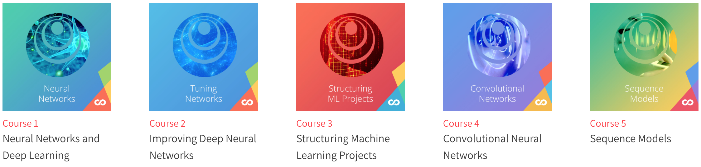
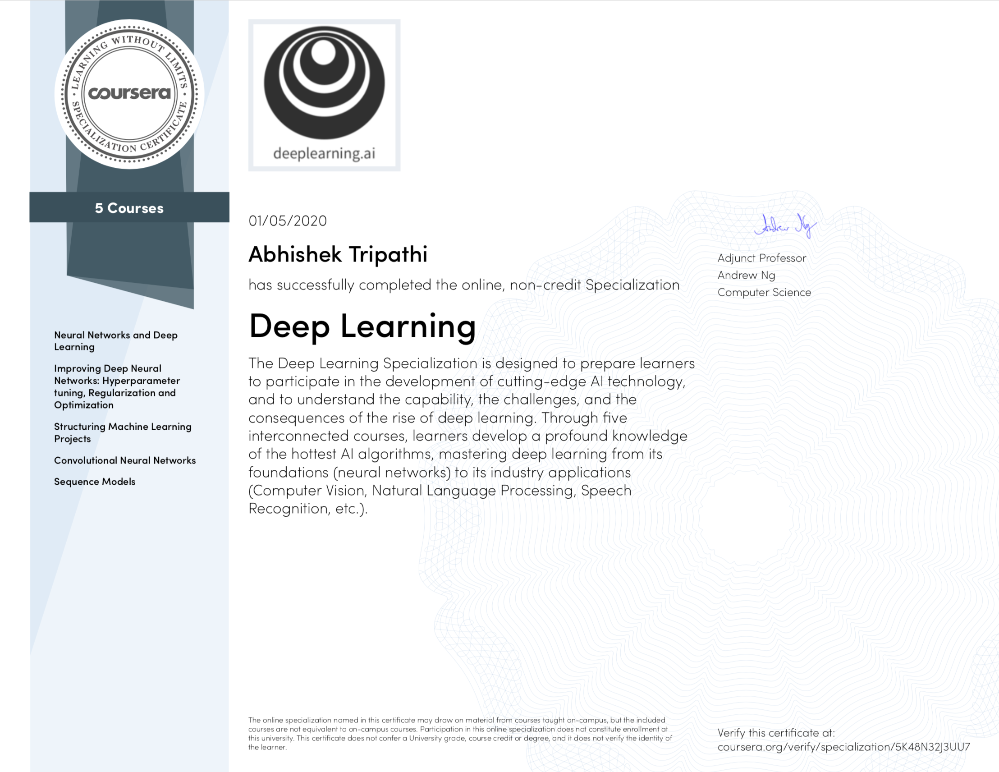

# Deep Learning Specialization
**Master Deep Learning, and Break into AI**

Instructor: [Andrew Ng](http://www.andrewng.org/)  
Community: [deeplearning.ai](https://www.deeplearning.ai/)

### Overview

I created this repository post completing the [Deep Learning Specialization](https://www.coursera.org/specializations/deep-learning) on coursera. Its includes solutions to the quizzes and programming assignments which are required for successful completion of the courses.

> Note: Coursera Honor Code advise against plagiarism. Readers are requested to use this repo only for insights and reference. If you are undertaking these courses at coursera, please submit you original work only.

The constitution of the repository as per course modules, quizzes and programming assignments is as follows:

1. [Neural Networks and Deep Learning](https://github.com/abhishektripathi24/Deep-Learning-Specialization-Coursera/tree/master/1.%20Neural-Networks-and-Deep-Learning)
    * week 1
        * [Quiz - Introduction to deep learning](https://github.com/abhishektripathi24/Deep-Learning-Specialization-Coursera/blob/master/1.%20Neural-Networks-and-Deep-Learning/week1/Quiz%20-%20Introduction%20to%20deep%20learning.pdf)
    * week 2
        * [Quiz - Neural Network Basics](https://github.com/abhishektripathi24/Deep-Learning-Specialization-Coursera/blob/master/1.%20Neural-Networks-and-Deep-Learning/week2/Quiz%20-%20Neural%20Network%20Basics.pdf)
        * [Programming Assignment - Python basics with numpy](https://github.com/abhishektripathi24/Deep-Learning-Specialization-Coursera/blob/master/1.%20Neural-Networks-and-Deep-Learning/week2/1.Python_Basics_With_Numpy_v3a.ipynb)
        * [Programming Assignment - Logistic Regression with a Neural Network mindset](https://github.com/abhishektripathi24/Deep-Learning-Specialization-Coursera/blob/master/1.%20Neural-Networks-and-Deep-Learning/week2/2.Logistic_Regression_with_a_Neural_Network_mindset_v6a.ipynb)
    * week 3
        * [Quiz - Shallow Neural Networks](https://github.com/abhishektripathi24/Deep-Learning-Specialization-Coursera/blob/master/1.%20Neural-Networks-and-Deep-Learning/week3/Quiz%20-%20Shallow%20Neural%20Networks.pdf)
        * [Programming Assignment - Planar data classification with a hidden layer](https://github.com/abhishektripathi24/Deep-Learning-Specialization-Coursera/blob/master/1.%20Neural-Networks-and-Deep-Learning/week3/Planar_data_classification_with_onehidden_layer_v6c.ipynb)
    * week 4
        * [Programming Assignment - Building your Deep Neural Network: Step by Step](https://github.com/abhishektripathi24/Deep-Learning-Specialization-Coursera/blob/master/1.%20Neural-Networks-and-Deep-Learning/week4/1.Building_your_Deep_Neural_Network_Step_by_Step_v8a.ipynb)
        * [Programming Assignment - Deep Neural Network - Application](https://github.com/abhishektripathi24/Deep-Learning-Specialization-Coursera/blob/master/1.%20Neural-Networks-and-Deep-Learning/week4/2.Deep%2BNeural%2BNetwork%2B-%2BApplication%2Bv8.ipynb)
2. [Improving Deep Neural Networks Hyperparameter tuning, Regularization and Optimization](https://github.com/abhishektripathi24/Deep-Learning-Specialization-Coursera/tree/master/2.%20Improving-Deep-Neural-Networks)
    * week 1
        * [Quiz - Practical aspects of deep learning](https://github.com/abhishektripathi24/Deep-Learning-Specialization-Coursera/blob/master/2.%20Improving-Deep-Neural-Networks/week1/Quiz%20-%20Practical%20aspects%20of%20deep%20learning.pdf)
        * [Programming Assignment - Initialization](https://github.com/abhishektripathi24/Deep-Learning-Specialization-Coursera/blob/master/2.%20Improving-Deep-Neural-Networks/week1/1.Initialization.ipynb)
        * [Programming Assignment - Regularization](https://github.com/abhishektripathi24/Deep-Learning-Specialization-Coursera/blob/master/2.%20Improving-Deep-Neural-Networks/week1/2.Regularization_v2a.ipynb)
        * [Programming Assignment - Gradient Checking](https://github.com/abhishektripathi24/Deep-Learning-Specialization-Coursera/blob/master/2.%20Improving-Deep-Neural-Networks/week1/3.Gradient%2BChecking%2Bv1.ipynb)
    * week 2
        * [Quiz - Optimization algorithms](https://github.com/abhishektripathi24/Deep-Learning-Specialization-Coursera/blob/master/2.%20Improving-Deep-Neural-Networks/week2/Quiz%20-%20Optimization%20algorithms.pdf)
        * [Programming Assignment - Optimization](https://github.com/abhishektripathi24/Deep-Learning-Specialization-Coursera/blob/master/2.%20Improving-Deep-Neural-Networks/week2/Optimization_methods_v1b.ipynb)
    * week 3
        * [Quiz - Hyperparameter tuning, Batch Normalization, Programming Frameworks](https://github.com/abhishektripathi24/Deep-Learning-Specialization-Coursera/blob/master/2.%20Improving-Deep-Neural-Networks/week3/Quiz%20-%20Hyperparameter%20tuning%2C%20Batch%20Normalization%2C%20Programming%20Frameworks.pdf)
        * [Programming Assignment - Tensorflow](https://github.com/abhishektripathi24/Deep-Learning-Specialization-Coursera/blob/master/2.%20Improving-Deep-Neural-Networks/week3/TensorFlow_Tutorial_v3b.ipynb)
3. [Structuring Machine Learning Projects](https://github.com/abhishektripathi24/Deep-Learning-Specialization-Coursera/tree/master/3.%20Structuring-Machine-Learning-Projects)
    * week 1
        * [Quiz - Bird recognition in the city of Peacetopia (case study)](https://github.com/abhishektripathi24/Deep-Learning-Specialization-Coursera/blob/master/3.%20Structuring-Machine-Learning-Projects/week1/Quiz%20-%20Bird%20recognition%20in%20the%20city%20of%20Peacetopia.pdf)
    * week 2
        * [Quiz - Autonomous driving (case study)](https://github.com/abhishektripathi24/Deep-Learning-Specialization-Coursera/blob/master/3.%20Structuring-Machine-Learning-Projects/week2/Quiz%20-%20Autonomous%20driving.pdf)
4. [Convolutional Neural Networks](https://github.com/abhishektripathi24/Deep-Learning-Specialization-Coursera/tree/master/4.%20Convolutional-Neural-Networks)
    * week 1
        * [Quiz - The basics of ConvNets](https://github.com/abhishektripathi24/Deep-Learning-Specialization-Coursera/blob/master/4.%20Convolutional-Neural-Networks/week1/Quiz%20-%20The%20basics%20of%20ConvNets.pdf)
        * [Programming Assignment - Convolutional Model: step by step](https://github.com/abhishektripathi24/Deep-Learning-Specialization-Coursera/blob/master/4.%20Convolutional-Neural-Networks/week1/1.Convolution_model_Step_by_Step_v2a.ipynb)
        * [Programming Assignment - Convolutional Model: application](https://github.com/abhishektripathi24/Deep-Learning-Specialization-Coursera/blob/master/4.%20Convolutional-Neural-Networks/week1/2.Convolution_model_Application_v1a.ipynb)
    * week 2
        * [Quiz - Deep convolutional models](https://github.com/abhishektripathi24/Deep-Learning-Specialization-Coursera/blob/master/4.%20Convolutional-Neural-Networks/week2/Quiz%20-%20Deep%20convolutional%20models.pdf)
        * [Programming Assignment - Keras Tutorial](https://github.com/abhishektripathi24/Deep-Learning-Specialization-Coursera/blob/master/4.%20Convolutional-Neural-Networks/week2/1.Keras_Tutorial_v2a.ipynb)
        * [Programming Assignment - Residual Networks](https://github.com/abhishektripathi24/Deep-Learning-Specialization-Coursera/blob/master/4.%20Convolutional-Neural-Networks/week2/2.Residual_Networks_v2a.ipynb)
    * week 3
        * [Quiz - Detection algorithms](https://github.com/abhishektripathi24/Deep-Learning-Specialization-Coursera/blob/master/4.%20Convolutional-Neural-Networks/week3/Quiz%20-%20Detection%20algorithms.pdf)
        * [Programming Assignment - Car detection with YOLO](https://github.com/abhishektripathi24/Deep-Learning-Specialization-Coursera/blob/master/4.%20Convolutional-Neural-Networks/week3/Autonomous_driving_application_Car_detection_v3a.ipynb)
    * week 4
        * [Quiz - Special applications: Face recognition & Neural style transfer](https://github.com/abhishektripathi24/Deep-Learning-Specialization-Coursera/blob/master/4.%20Convolutional-Neural-Networks/week4/Quiz%20-%20Special%20applications-%20Face%20recognition%20%26%20Neural%20style%20transfer.pdf)
        * [Programming Assignment - Art generation with Neural Style Transfer](https://github.com/abhishektripathi24/Deep-Learning-Specialization-Coursera/blob/master/4.%20Convolutional-Neural-Networks/week4/1.Art_Generation_with_Neural_Style_Transfer_v3a.ipynb)
        * [Programming Assignment - Face Recognition](https://github.com/abhishektripathi24/Deep-Learning-Specialization-Coursera/blob/master/4.%20Convolutional-Neural-Networks/week4/2.Face_Recognition_v3a.ipynb)
5. [Sequence Models](https://github.com/abhishektripathi24/Deep-Learning-Specialization-Coursera/tree/master/5.%20Recurrent-Neural-Networks)
    * week 1
        * [Quiz - Recurrent Neural Networks](https://github.com/abhishektripathi24/Deep-Learning-Specialization-Coursera/blob/master/5.%20Recurrent-Neural-Networks/week1/Quiz%20-%20Recurrent%20Neural%20Networks.pdf)
        * [Programming Assignment - Building a recurrent neural network - step by step](https://github.com/abhishektripathi24/Deep-Learning-Specialization-Coursera/blob/master/5.%20Recurrent-Neural-Networks/week1/1.Building_a_Recurrent_Neural_Network_Step_by_Step_v3a.ipynb)
        * [Programming Assignment - Dinosaur Island - Character-Level Language Modeling](https://github.com/abhishektripathi24/Deep-Learning-Specialization-Coursera/blob/master/5.%20Recurrent-Neural-Networks/week1/2.Dinosaurus_Island_Character_level_language_model_final_v3a.ipynb)
        * [Programming Assignment - Jazz improvisation with LSTM](https://github.com/abhishektripathi24/Deep-Learning-Specialization-Coursera/blob/master/5.%20Recurrent-Neural-Networks/week1/3.Improvise_a_Jazz_Solo_with_an_LSTM_Network_v3a.ipynb)
    * week 2
        * [Quiz - Natural Language Processing & Word Embeddings](https://github.com/abhishektripathi24/Deep-Learning-Specialization-Coursera/blob/master/5.%20Recurrent-Neural-Networks/week2/Quiz%20-%20Natural%20Language%20Processing%20%26%20Word%20Embeddings.pdf)
        * [Programming Assignment - Operations on word vectors - Debiasing](https://github.com/abhishektripathi24/Deep-Learning-Specialization-Coursera/blob/master/5.%20Recurrent-Neural-Networks/week2/1.Operations_on_word_vectors_v2a.ipynb)
        * [Programming Assignment - Emojify](https://github.com/abhishektripathi24/Deep-Learning-Specialization-Coursera/blob/master/5.%20Recurrent-Neural-Networks/week2/2.Emojify_v2a.ipynb)
    * week 3
        * [Quiz - Sequence models & Attention mechanism](https://github.com/abhishektripathi24/Deep-Learning-Specialization-Coursera/blob/master/5.%20Recurrent-Neural-Networks/week3/Quiz%20-%20Sequence%20models%20%26%20Attention%20mechanism.pdf)
        * [Programming Assignment - Neural Machine Translation with Attention](https://github.com/abhishektripathi24/Deep-Learning-Specialization-Coursera/blob/master/5.%20Recurrent-Neural-Networks/week3/1.Neural_machine_translation_with_attention_v4a.ipynb)
        * [Programming Assignment - Trigger word detection](https://github.com/abhishektripathi24/Deep-Learning-Specialization-Coursera/blob/master/5.%20Recurrent-Neural-Networks/week3/2.Trigger_word_detection_v1a.ipynb)

### Lecture Notes References
Here are some references of lecture notes and reviews drawn by some communities, authors and editors - 
* https://www.deeplearning.ai/ai-notes/
* https://www.slideshare.net/TessFerrandez/notes-from-coursera-deep-learning-courses-by-andrew-ng

### Acknowledgement

Deep Learning Specialization offered by Andrew Ng is an excellent blend of content for deep learning enthusiasts. I thoroughly enjoyed the course and earned the [certificate](https://www.coursera.org/account/accomplishments/specialization/certificate/5K48N32J3UU7).
  
